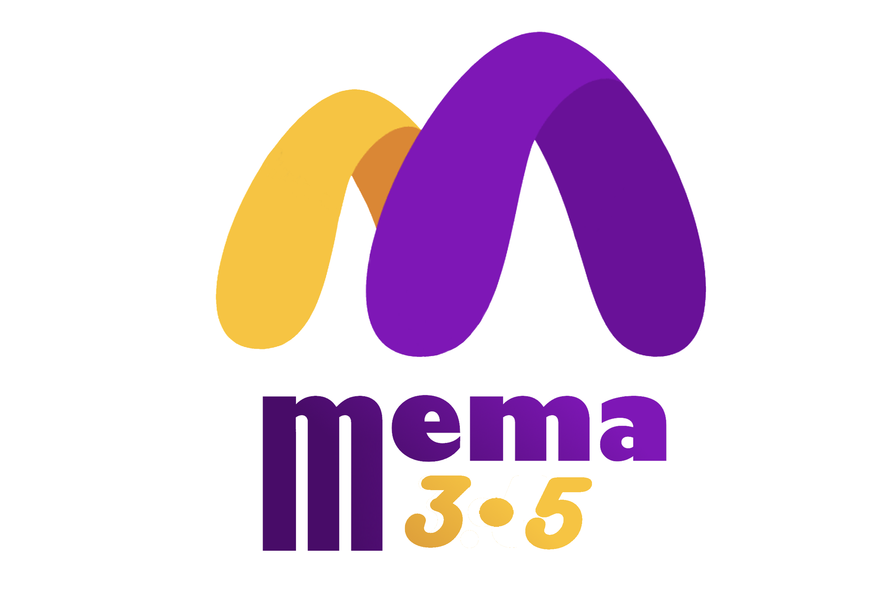

<!-- PROJECT LOGO -->
 

  

<h3 align="center">Memory Machine (MeMa)</h3>

  

    Memory Machine is an accessible and user-friendly device designed for older adults to store and cherish their memories. By integrating advanced technologies such as text-to-speech, speech recognition, and facial recognition, it enables effortless interaction, enhances accessibility, and provides a secure repository for preserving and reliving precious moments.
     
    <a href="https://github.com/tobybenjaminclark/mema/wiki">Wiki</a>
    ·
    <a href="https://github.com/tobybenjaminclark/mema">Demo</a>
    ·
    <a href="https://github.com/tobybenjaminclark/mema/issues">Issues</a>
  

<!-- TABLE OF CONTENTS -->

  
Table of Contents

  <ol>
    <li>
      <a href="#about-the-project">Project Vision</a>
    </li>
    <li>
      <a href="#setup-&-getting-started">Setup & Installation</a>
      <ul>
        <li><a href="#prerequisites">Prerequisites</a></li>
        <li><a href="#installation">Installation</a></li>
      </ul>
    </li>
    <li><a href="#usage">Usage</a></li>
    <li><a href="#roadmap">Roadmap</a></li>
    <li><a href="#contributing">Contributing</a></li>
    <li><a href="#license">License</a></li>
    <li><a href="#contact">Contact</a></li>
    <li><a href="#acknowledgments">Acknowledgments</a></li>
  </ol>

<!-- ABOUT THE PROJECT -->
## About The Project

[![Product Name Screen Shot][product-screenshot]](https://example.com)

The **Memory Machine/MeMa** represents a device specifically engineered to serve as an extensive memory repository, catering to the *unique needs of older adults*. With a paramount focus on **accessibility** and **usability**, this innovative solution enables individuals to **store and safeguard their treasured memories** through a user-friendly interface. The Memory Machine seamlessly integrates advanced technologies, including `Text-to-Speech (TTS)`` utilizing [gTTS](https://gtts.readthedocs.io/en/latest/), [speech recognition](https://pypi.org/project/SpeechRecognition/), and [facial recognition](https://pypi.org/project/face-recognition/), thereby enhancing the overall user experience and facilitating effortless interaction with the device.

The fundamental objective of the Memory Machine is to **empower older adults in capturing and reliving moments of profound significance**. Through its intuitive design, this device allows users to **store memories in diverse formats**, ranging from *spoken anecdotes* to *visual content*. The incorporation of *TTS* functionality enables the machine to convert *text-based memories* into *highly naturalized speech*, rendering them accessible to individuals with **visual impairments**. Moreover, the integration of speech recognition capabilities facilitates *hands-free* interaction, further *augmenting accessibility* and simplifying the device's operation.

A notable feature of the Memory Machine is it's **facial recognition functionality**, which removes the necessity to remember long, complicated passwords. As the target use-case is **older people**, MeMa 3.1 allows for a facial-based login system, similar to the iOS FaceID system. It's important that **memories are protected and secure**, which is a fundamental value in MeMa's Design.

In summary, the **Memory Machine provides a robust and inclusive solution for storing and reliving memories**, while specifically addressing the requirements of older adults. By seamlessly incorporating `TTS`, `speech recognition`, and `facial recognition` technologies, this device ensures *accessibility* and *ease of use*, ultimately **enabling individuals to engage with their memories in a personalized and meaningful manner**. The Memory Machine stands as a testament to the advancements in memory preservation technology, consistently evolving, improving and adapting to new ways to capture and store memories.

(<a href="#readme-top">back to top</a>)

<!-- GETTING STARTED -->
## Setup & Getting Started

This is an example of how you may give instructions on setting up your project locally.
To get a local copy up and running follow these simple example steps.

### Prerequisites

MeMa has several dependencies that are going to be listed under this section. 

**Operating System Dependencies** 
MeMa 3.1 is currently available to deploy on Linux devices. Developed on [Ubuntu 22.04.2 LTS](https://releases.ubuntu.com/jammy/), this is the reccommended system. As MeMa should be used as a standalone device, it's **reccommended to use this version of Ubuntu** to avoid any errors.

There is no current support for **macOS** or **Windows** compatiable versions of MeMa, however with the current libraries this is possible to add.

**Device & Hardware Dependencies** 
MeMa 3.1 has several device-specific dependencies. These are pretty straight-forward, the device should contain the following:
* **Webcam/Camera** (Higher Quality for better Facial Recognition)
* **Microphone** (Higher Quality for better Speech Recognition)
* **Speaker**

In terms of processing-specific requirements, currently MeMa is too demanding to run on small embedded systems such as **Raspberry Pi**, and it is reccommended to run MeMa on a mini-pc inside of the operating shell.

**Python 3.11.4, PI & Tkinter Dependencies** 
It's important that your **system repository** is up to date, firstly run the following command to update any new package data. 
> sudo apt-get update

Now we must install Python 3.8, Tkinter and PIP. Tkinter is a graphics framework that comes as part of the standard library for the macOS and Windows versions of Python, however the Linux release does not include this base.

PIP (or pip) is Pythons package manager which we will later use to install further dependencies and libraries, such as **opencv**, **pillow** and **face_recognition**. For now, run the following 3 commands to install Python 3.8, PIP and Tkinter.
> sudo apt-get install python3.8 
> sudo apt install python3-pip 
> sudo apt-get install python3.8-tk

**Python Packages/Libraries** 
Several libraries are required to run MeMa, these are available in `requirements.txt` in the main repository. PIP will be able to perform a **one-line install of all package dependencies** using the following command. More information about the required packages is available in the [wiki](https://github.com/tobybenjaminclark/mema/wiki).
> pip install -r 'requirements.txt'

### Installation
In terms of installation, MeMa is easy to run and setup. Simply run the file at `codebank/mema_main_window.py`, this should setup and start the program. To create a new user, simply say 'new'.

(<a href="#readme-top">back to top</a>)

<!-- USAGE EXAMPLES -->
## Usage

Use this space to show useful examples of how a project can be used. Additional screenshots, code examples and demos work well in this space. You may also link to more resources.

_For more examples, please refer to the [Documentation](https://example.com)_

(<a href="#readme-top">back to top</a>)

<!-- ROADMAP -->
## Roadmap

- [ ] Feature 1
- [ ] Feature 2
- [ ] Feature 3
    - [ ] Nested Feature

See the [open issues](https://github.com/github_username/mema/issues) for a full list of proposed features (and known issues).

(<a href="#readme-top">back to top</a>)

<!-- CONTACT -->
## Contact

**Toby Benjamin Clark** 
Happy to help with any queries/implementation concerns. Please contact me by one of the below methods explaining the issue that you are facing and I will get back to you as soon as possible with assistance.

<a href="https://github.com/tobybenjaminclark/">GitHub</a>
·
<a href="https://www.linkedin.com/in/toby-clark-14350815a/">LinkedIn</a>
·
<a href="mailto:tobybenjaminclark@gmail.com">Email</a>

Project Link: [https://github.com/github_username/mema](https://github.com/github_username/mema)

(<a href="#readme-top">back to top</a>)

<!-- ACKNOWLEDGMENTS -->
## Acknowledgments

* 
* 
* 

(<a href="#readme-top">back to top</a>)
